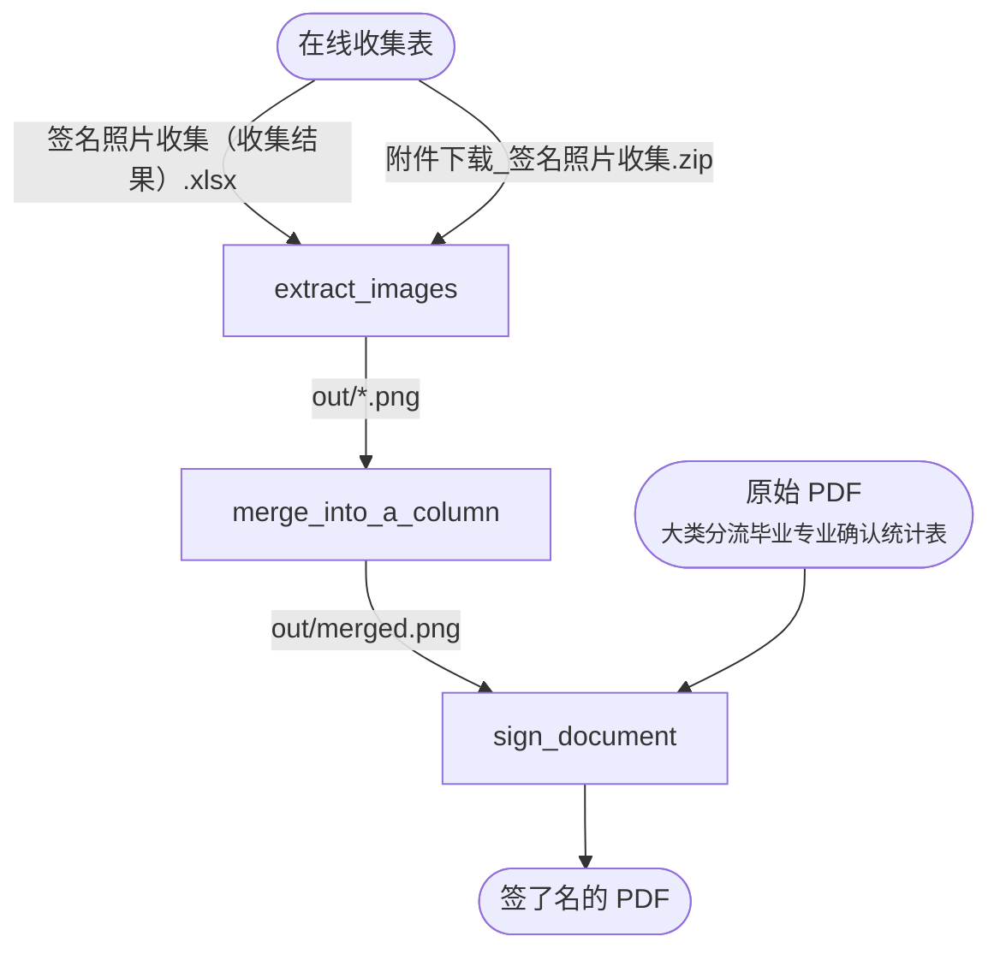

# Signs

整理腾讯在线收集表的签名。

1. 导出在线收集表
2. `extract_images.py`
3. `merge_into_a_column.py`
4. `sign_document.py`

所需文件请参考每段程序`if __name__ == "__main__":`后的定义。

## 导出在线收集表

### 数据及签名

1. 访问腾讯在线收集表统计页面（`https://docs.qq.com/form/page/<id>#/result`），关联表格为“智能表”（与“工作表”相对）。
2. 打开表格，（右上角）文档操作 → 导出 → 本地 Excel 表格。
3. “文档中含有附件，将随文档一起导出，确认导出吗？”确定。
4. 用 Excel 打开下载下来的文件，重新保存。（原文件包含不合法的 XML）

此表格B–D列依次为名称、图像（文件名）、签名。

### 图像

1. 访问腾讯在线收集表统计页面，照片题目 → 下载此题的全部文件。
2. “请选择下载方式”？默认下载，确定。
